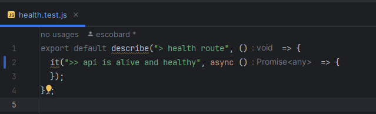

# integration-tests &middot;  

An integration test boilerplate, designed as a starting point for your API tests, built with JavaScript ES6+, Jest and Supertest.

Create and run a new test in a few steps:

#### 1. Create test

[Create a new test file](https://jestjs.io/docs/getting-started) in the [/tests](/tests) folder. The file name must end with `.test.js`:

#### 2. Apply the API endpoint you want to test

Add [the API endpoint](https://www.npmjs.com/package/supertest) you want to test in your test file:

#### 3. Add expect statements to validate API response

Add [expect statements](https://jestjs.io/docs/expect) to validate the API response:

#### 4. Run the tests

Run your test with `npm run test nameOfTestFile` or `npm run test` to run all tests:

# Table of contents

* [Quickstart](https://github.com/escobard/integration-tests?tab=readme-ov-file#quickstart)
* [Core concepts](https://github.com/escobard/integration-tests?tab=readme-ov-file#core-concepts)
* [System overview](https://github.com/escobard/integration-tests?tab=readme-ov-file#system-overview)
* [How to contribute](https://github.com/escobard/integration-tests?tab=readme-ov-file#how-to-contribute)
* [Tools and frameworks](https://github.com/escobard/integration-tests?tab=readme-ov-file#tools-and-frameworks)
* [License](https://github.com/escobard/integration-tests?tab=readme-ov-file#license)

## Quickstart

### Run test application with NPM

[Node.js v20.9.0+](https://nodejs.org/en/) must be installed.

The following npm scripts are available:

### Run a single test

`npm run test nameOfTestFile`

### Run all available tests

`npm run test`

### Run all available tests in order

Tests will run in the order outlined in the [/tests/testInOrder.test.js](/tests/testInOrder.test.js) file.

`npm start`

### Run tests in watch mode 

Re-reruns tests when a test file is updated. It is recommended to use watch mode when developing tests. Find out more at [Jest's watch mode documentation](https://jestjs.io/docs/en/cli#--watch).

### Run tests in a Docker container

[Docker](https://www.docker.com/) must be installed. Use this approach if you want to run the tests in a container, without installing Node.js. It is common to use this approach in a CI/CD pipeline.

`docker build -t your-user-name/integration-tests:latest -f docker/Dockerfile.ci .`
`docker run --name integration-tests -t your-user-name/integration-tests:latest`

## Core concepts

1. [Serve as a starting point for complex integration test use cases](https://github.com/escobard/integration-tests?tab=readme-ov-file#serve-as-a-starting-point-for-complex-integration-test-use-cases)
2. [Provide simple, modular code structures & design patterns](https://github.com/escobard/integration-tests?tab=readme-ov-file#provide-simple-modular-code-structures--design-patterns)
3. [Leverage data driven tests with Jest](https://github.com/escobard/integration-tests?tab=readme-ov-file#leverage-data-driven-tests-with-jest)
4. [Follow the automation test pyramid principles](https://github.com/escobard/integration-tests?tab=readme-ov-file#follow-the-automation-test-pyramid-principles)
5. [Run tests in a Docker container for CI/CD](https://github.com/escobard/integration-tests?tab=readme-ov-file#run-tests-in-a-docker-container-for-cicd)

### Serve as a starting point for complex integration test use cases

When APIs expand past single CRUD operations, developers tend to seek a way to validate that old endpoints continue to work as expected, while new endpoints are developed. As new endpoints are developed, it becomes more challenging to validate old endpoints. Integration tests are a great way to validate that an API continues to work as expected, as it grows in complexity.

Leveraging [Jest](https://jestjs.io/) and [Supertest](https://www.npmjs.com/package/supertest), this repository provides a starting point for complex integration test use cases. The tests are designed to be modular, allowing developers to easily add new tests and endpoints as APIs grow in complexity.

### Provide simple, modular code structures & design patterns

Using Jest's setup and teardown functionality, global imports minimize inline imports, allowing test syntax complexity to remain low. API endpoints can (optionally) be configured globally before setup and teardown, facilitating readability and re-usability as the number of tests grow. By using Jest's run-in-band functionality, changing the order in which tests are run can be easily changed by swapping the order of the tests imported in [/tests/testInOrder.test.js](/tests/testInOrder.test.js).

### Leverage data driven tests with Jest

Leveraging [Jest's data driven testing](https://jestjs.io/docs/api#describeeachtablename-fn-timeout), tests can be written once and run multiple times with different data. Due to the data-heavy nature of GraphQL, data driven tests make it easier to validate API responses with minimal code. This is useful when testing CRUD operations, as the same test can be run with different data, without having to write multiple tests.

### Follow the automation test pyramid principles

This project encourages Mike Cohn's [automation test pyramid](https://martinfowler.com/articles/practical-test-pyramid/testPyramid.png) principles to automated testing. 

The test pyramid paradigm encourages developers to build more unit tests (since they are small and fast), than service (or integration) tests, and more service tests than UI (or e2e) tests (which are slow and heavy).

### Run tests in a Docker container for CI/CD

With Docker, the test application can be run in a container, without having to install Node.js. This is useful when running tests in a CI/CD pipeline, as it allows the user to run tests without having to install Node.js or any of the application dependencies. The test application can be easily built and run with Docker, without the need of any additional setup in your CI/CD pipeline, as long as Docker is supported. 

## System overview

This project is meant to run as part of a larger system, which requires integration tests to validate the system's functionality as new features are developed. Within [the aws-cloud-apps repository](https://github.com/escobard/aws-cloud-apps), you will find an example of the integration tests running in combination with a GraphQL API and PostgreSQL Database.

The diagram below outlines a network created with Docker Compose, showcasing connections between the tests, an API and a Database:

## Tools and frameworks

[Node.js](https://nodejs.org/en)  
[Jest](https://jestjs.io/)  
[Supertest](https://www.npmjs.com/package/supertest)    
[Docker](https://www.docker.com/)

## How to contribute

### Commits

Our commits follow the [Angular commit styleguide](https://gist.github.com/brianclements/841ea7bffdb01346392c). Each commit should be carefully thought out and only contain files affected within the scope of the commit message.

### Branching

A branch's name should reference a story and the type of work being committed.

### Pull Requests

Each pull request must pass a review from another contributor and all automated tests.

### Issues

Feel free to open an issue ticket, please leave a screenshot and a detailed instructions on how to replicate the issue.

## License

This repository is protected under the [MIT License](https://choosealicense.com/licenses/mit/).
